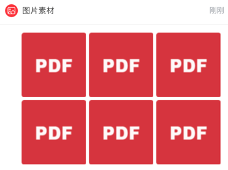

随着 ReactNative 的不断更新，ListView 这个组件逐步被 FlatList 和 SectionList 取代。ListView 从出生之后就饱受诟病，比如不支持单独的头部和尾部组件，并且当列表数据源过大时，占用内存明显增加性能受到影响，无法达到 60FPS 。在这样的背景下，FlatList 和 SectionList 就应运而生了，FlatList 用于无分组的列表，而 SectionList 用于有分组的列表。

而我在使用 SectionList 的过程中有一个需求需要实现，分组中的其他 Section 内都使用普通列表就可以，但是其中一组是图片展示的，需要使用九宫格来展示。那么这时候该如何实现需求呢？

先来看一下 SectionList 的简单使用:

```jsx
<SectionList
  renderItem={({item}) => <ListItem title={item.title} />}
  renderSectionHeader={({section}) => <H1 title={section.key} />}
  sections={[ // 不同section渲染相同类型的子组件
    {data: [...], key: ...},
    {data: [...], key: ...},
    {data: [...], key: ...},
  ]}
/>
```

在看一下我们需要实现的效果:



类似于这样的九宫格效果。

其实我实现的思路非常简单，先处理修改每个 section 中的数据源的格式，将数据再包入一层数组中，例如：

```js
{data: [{item: 1}, {item: 2}, {item: 3}]} // 修改之前
{data: [[{item: 1}, {item: 2}, {item: 3}]]} //修改之后
```

请各位同学仔细比较上述两组的修改，明确修改的不同点，在完成之后呢我们来这样写我们的 render 函数。

```js
_renderImageItem = (item) => (
  <View style={styles.imgContainer}>
    {item.map((item, i) => (
      <View key={i} style={styles.imgItemWrap}>
        <Image style={styles.imgItemStyle} source={require('xxx.png')} />
      </View>
    ))}
  </View>
)
```

可以看到函数的结构很简单，就是一个遍历，而关键点在于布局，我们利用 flex 布局的特性，完成九宫格排列。

```js
const styles = StyleSheet.create({
  imgContainer: {
    display: 'flex',
    flexDirection: 'row',
    flexWrap: 'wrap',
  }
});
```

最关键的 imageContiner 的布局写法就是这样，首先使用 flexDirection 为 `row` 的属性值实现横向排列，再使用 flexWrap 为 `wrap` 的属性值使图片换行，这样的操作下，一个简易的九宫格布局就完成了。当然我知道这样的完成并不是最好的，我也只是提供一种实现的思路，如果有小伙伴能不改变数据源结构就完成操作的话，希望在博客底下留言评论，能让我也学习进步，感激不尽！
