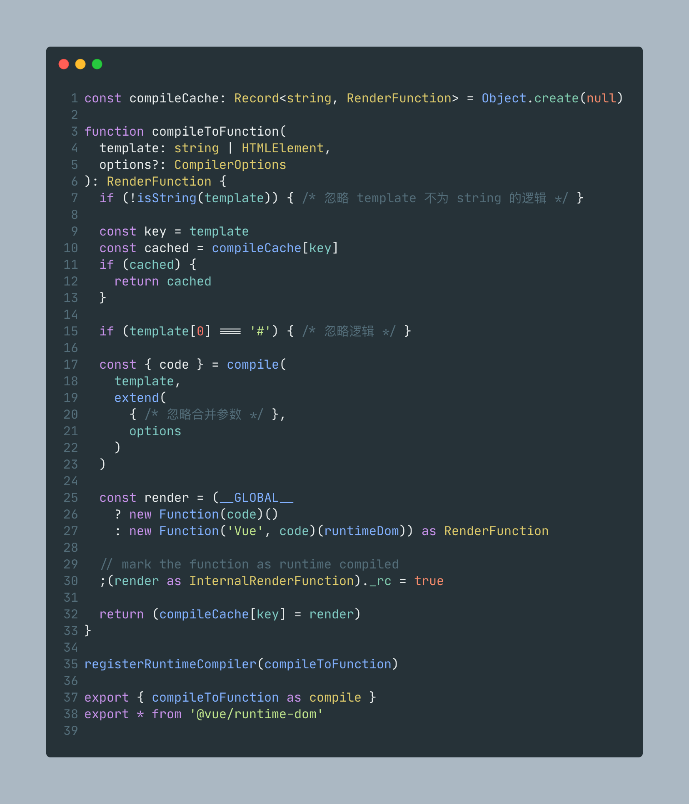
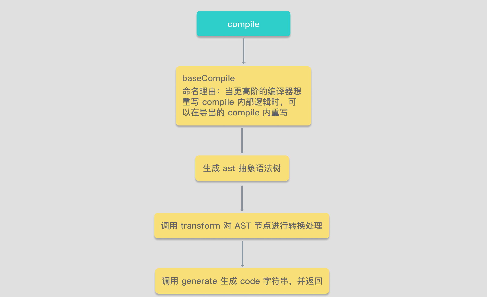
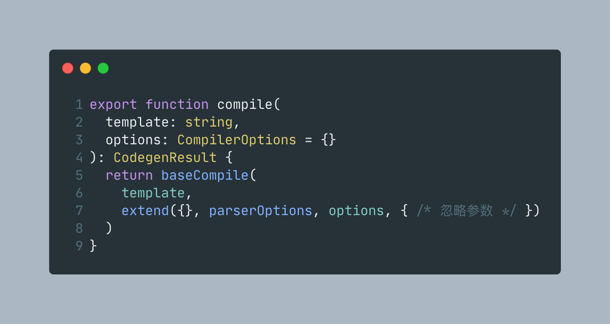
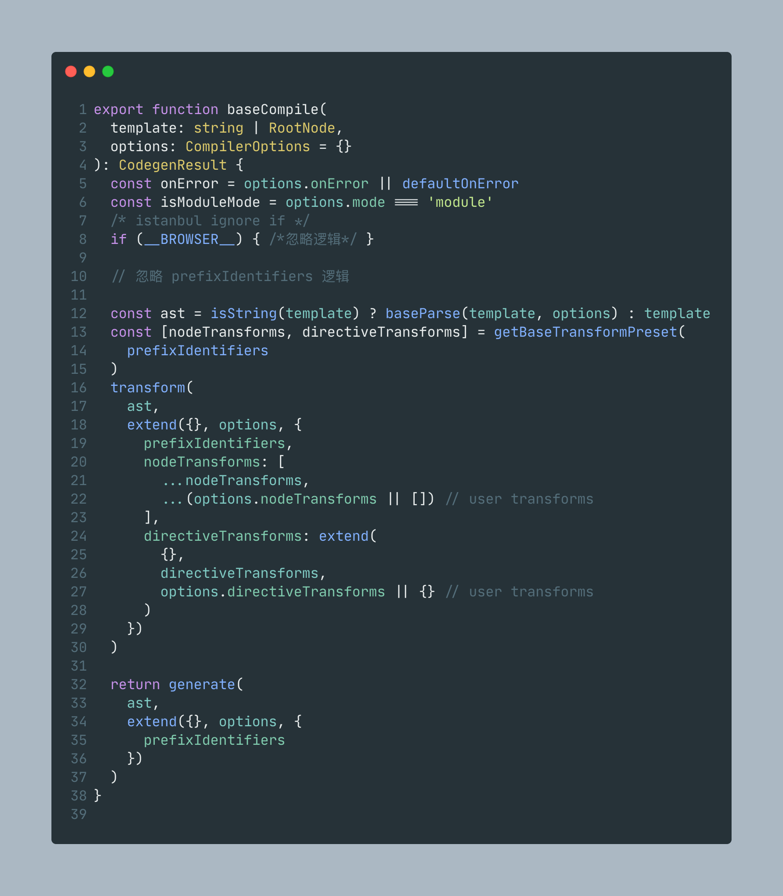

Vue3 发布已经有一段时间了，最近也有机会在公司项目中用上了 Vue3 + TypeScript + Vite 的技术栈，所以闲暇之余抽空也在抽空阅读 Vue3 的源码。本着好记性不如烂笔头的想法，在阅读源码时顺便记录了一些笔记，也希望能争取写一些源码阅读笔记，帮助每个想看源码但可能存在困难的同学减少理解成本。


Vue2.x 的源码我也有过一些简单的阅读，自 Vue3 重构后，Vue 项目的目录结构也发生了很大的变化，各个功能模块被分别放入了 `packages` 目录下，职责更加清晰，通过目录名就可以一目了然。今天将从 Vue 的入口文件开始，看看声明了一个 Vue 的单文件之后是如何被 `compile-core` 编译核心模块编译成渲染函数的。

为了大家的阅读方便，以及控制文章篇幅，我会把阅读源码时不太需要在意的逻辑进行折叠，或者通过注释 `/* 忽略逻辑 */` 这样的标识进行忽略处理。

我个人是不太喜欢在看源码分析文章时一上来就怼出一大段代码，这容易让没阅读的同学有点懵逼。所以这个系列的文章我会尽量对关键的代码画出一张流程图。目的还是一个，帮助大家降低理解成本，同时也让各位同学在下次自主阅读时有张流程图能参考。

我们会先从一个 vue 文件创建的入口来开始我们的源码阅读， `packages/vue/index.ts` 。这个入口文件的代码比较简单，只有一个 `compileToFunction` 函数，但函数体内的内容却又比较关键，所以先看一张图，来理解这个函数体究竟完成了哪些事情。


在看完流程图之后，我们来对照代码一起看，我相信大部分同学在此时可能对下发图片中的代码一目了然了。



直接跳过所有代码，看文件的末尾 35 行，调用了 registerRuntiomCompiler 函数，将 compileToFunction 函数作为参数传入，这行代码即对应流程图的起始，通过依赖注入的方式，将 compile 函数注入至 runtime 运行时中，依赖注入是一种比较巧妙的解耦方式，此时运行时再调用 compile 编译函数，就是在调用当前的 compileToFunction 函数了。

再看代码中的第 17 行，调用了 compile-dom 库提供的 compile 函数，从返回值中解构出了 code 变量。这个就是编译器执行之后生成的编译结果，code 是编译结果的其中一个参数，是一个代码字符串。比如

```vue
<template>
  <div>
    Hello World
  </div>
</template>
```

这个简单的模板，在经过编译后，code 返回的字符串为 `const _Vue = Vue return function render(_ctx, _cache) {  with (_ctx) {    const { openBlock: _openBlock, createBlock: _createBlock } = _Vue     return (_openBlock(), _createBlock("div", null, "Hello World"))  } }` ，这个神奇的 compile 函数内部的奥妙在之后我会详细讲解。 

在拿到这个这个代码字符串的结果后，我们再顺着代码往下看，第 25 行声明了一个 render 变量，并且将生成的代码字符串 code 作为参数传入了 new Function 构造函数。这就是流程图中的倒数第二步，生成了 render 函数。可以将我放在上面的 code 字符串格式化，能够发现 render 函数是一个柯里化的函数，返回了一个函数，函数内部通过 with 来扩展作用域链。

而最后入口文件返回了 render 变量，并且顺手缓存了 render 函数。

上方源码的第 1 行，我们看到入口文件创建了一个 `compileCache`  对象，用以缓存 `compileToFunction` 函数生成的 `render`  函数，将 template 参数作为缓存的 key， 并在 11 行的位置有一个 if 分支做缓存的判断，如果该模板之前被缓存过，则不再进行编译，直接返回缓存中的 render 函数，以此提高性能。

至此 package/vue/index.ts 的入口文件就解读完了。相信大家也都看出来了，最有意思的部分就是调用 compile 函数编译出了代码字符串，所以接下来我将围绕 compile 函数来接着唠。compile 函数牵扯到 compile-dom 和 compile-core 两个模块，本篇文章我只会解读关键流程。细节分析的话会放在后续文章中。一起来看一下 compile 的运行流程：



compile 函数内部直接返回 baseCompile 函数的结果，而 baseCompile 函数在执行过程中会生成 AST 抽象语法树，并调用 transform 对 每个 AST 节点进行处理，例如转换vOn、v-if、v-for 等指令，最后将处理后的 AST 抽象语法树通过 generate 函数生成之前提及的代码字符串，并返回编译结果，至此 compile 函数执行完毕。明白了大体的流程后，接着来看源码。



compile 函数的源码路径是 packages/compiler-dom/src/index.ts， 我们看到在 compile 的函数体内，直接 return 了 baseCompile 的处理结果。而 baseCompile 的源码路径是 packages/compiler-core/src/compile.ts 。为什么会有 baseCompile 这样的命名呢？因为 compile-core 是编译的核心模块，接受外部的参数来按照规则完成编译，而 compile-dom 是专门处理浏览器场景下的编译，在这个模块下导出的 compile 函数是入口文件真正接收的编译函数。而 compile-dom 中的 compile 函数相对 baseCompile 也是更高阶的一个编译器。例如当 Vue 在 weex 在 iOS 或者 Android 这些 Native App 中工作时，compile-dom 可能会被相关的移动端编译库来取代。

顺着往下一起看一下 baseCompile 函数:




先从函数声明中来看，baseCompile 接收 template 模板以及上层高阶编译器中处理过 options 编译选项，最终返回一个 CodegenResult 类型的编译结果。

```typescript
export interface CodegenResult {
  code: string
  preamble: string
  ast: RootNode
  map?: RawSourceMap
}
```

通过 CodegenResult 的接口声明能清晰的看到返回结果中存在 code 代码字符串、处理后的 AST 抽象语法树，以及 sourceMap。

看上方源码的第 12 行，判断 template 模板是否为字符串，如果是的话则会对字符串进行解析，否则直接将 template 作为 AST 。其实我们平时在写的单文件 vue 代码，都是以字符串的形式传递进去的。

接下来源码是 16 行调用了 transform 函数，以及传入了指令转换、节点转换等工具函数，对由模板生成的 AST 进行转换。

最终的 32 行位置，我们将转换好的 AST 传入 generate，生成 CodegenResult 类型的返回结果。

在 compile-core 模块中，AST 解析、transform、codegen、compile、parse 这些函数都是一个单独的小模块，内部的实现都非常精妙，在编译器的后续文章中，会逐个进行介绍。

本文通过从入口文件开始，对编译的大体流程进行解释，希望可以帮助大家在阅读编译器这个模块的代码时能有一个清晰的流程概念，配合流程图食用更香哟。